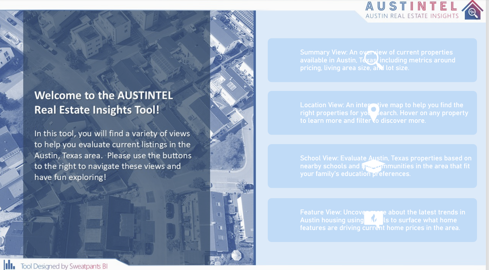
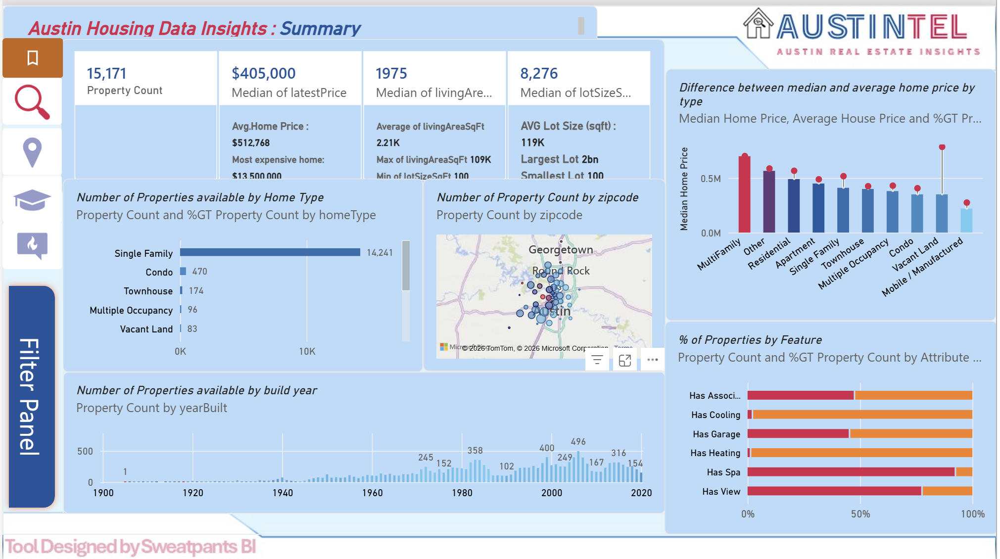
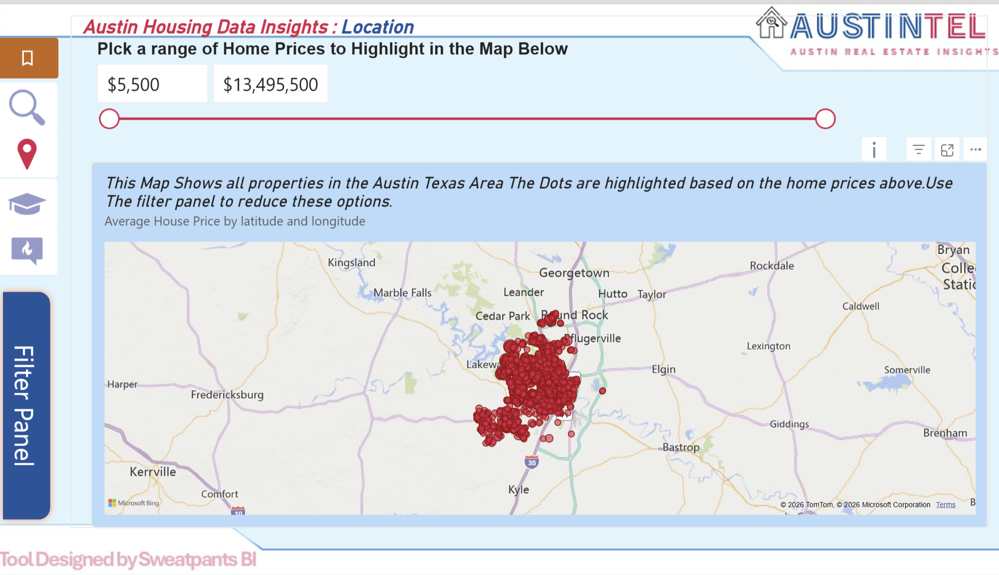
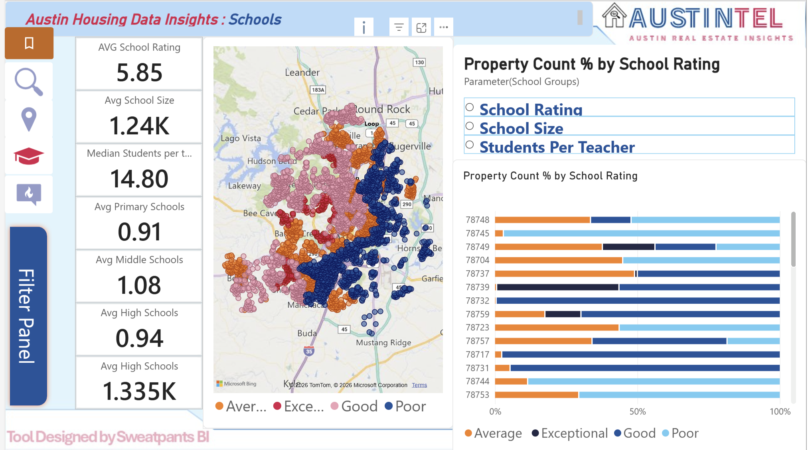
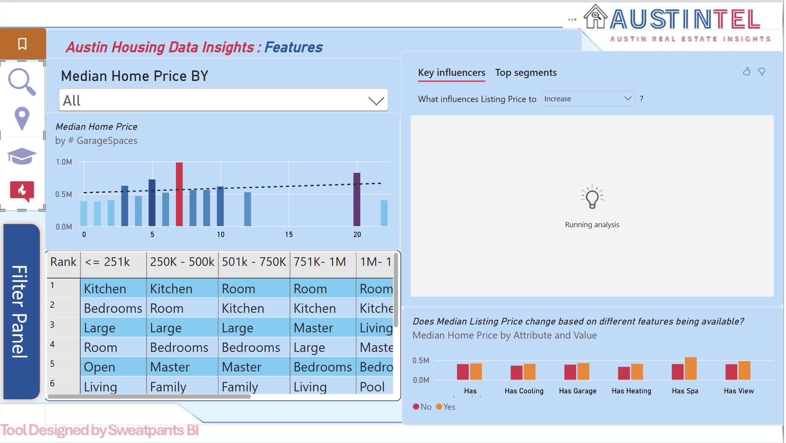
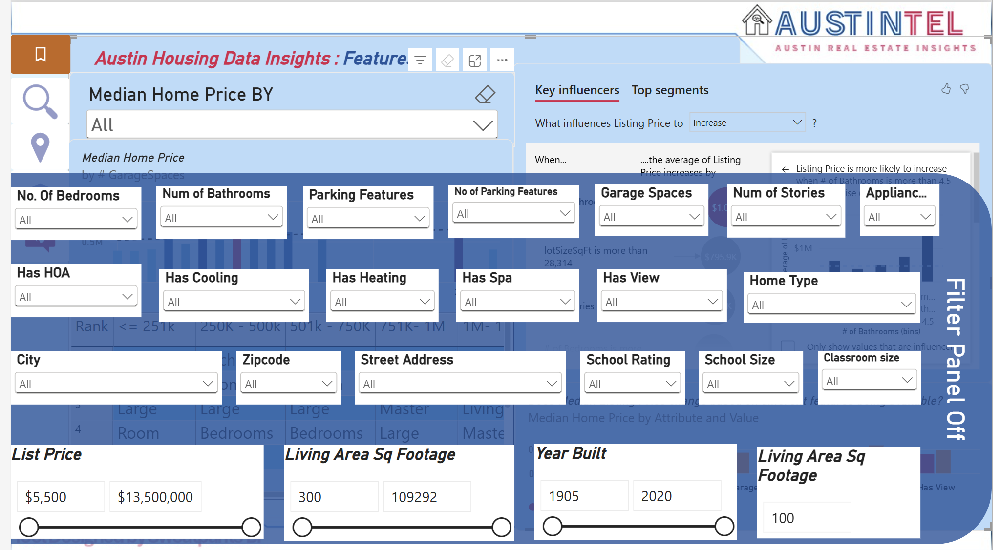
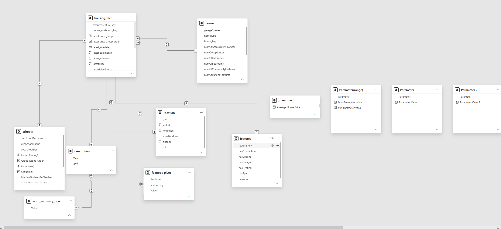

# 🏠 Austin Housing Data Insights
### Power BI Housing Market Analysis

## 📌 Project Overview

This project analyses **15,171 residential properties** from the Austin, Texas housing market using **Power BI**.

The goal was to understand how property prices vary by:

- Location
- Home type
- Living area
- Lot size
- Bedrooms and bathrooms
- Property features
- School characteristics
- Amenities

The report starts with an overall market view and then lets users explore location, schools, property features and individual listings in more detail.

The main tools used were:

- Power BI
- Power Query
- DAX
- Data modelling
- Field parameters
- Key Influencers
- Geographic mapping
- Interactive filters and tooltips

---

# 🖥️ Power BI Report

## Cover Page



The cover page provides navigation to the main sections of the report:

- Summary View
- Location View
- School View
- Feature View

This gives users a simple starting point before moving into the detailed analysis.

---

# 🎯 Business Questions

The project was built around a few practical housing-market questions:

- Where are higher- and lower-priced properties located?
- Which property types are most common?
- How different are median and average property prices?
- Which property features are associated with higher prices?
- How do school characteristics vary across neighbourhoods?
- Are amenities such as garages, views and spas more common in higher-priced homes?
- Which factors appear to be associated with listing price?
- How can users compare specific property segments interactively?

---

# 📊 Dataset Overview

| Metric | Result |
|---|---:|
| Total Properties | **15,171** |
| Median Property Price | **$405,000** |
| Average Property Price | **$512,768** |
| Median Living Area | **1,975 sq ft** |
| Average Living Area | **2.21K sq ft** |
| Median Lot Size | **8,276 sq ft** |
| Average Lot Size | **119K sq ft** |
| Maximum Property Price | **$13.5M** |

The dataset includes information on:

- Property price
- Home type
- City
- ZIP code
- Street address
- Latitude and longitude
- Bedrooms
- Bathrooms
- Living area
- Lot size
- Garage spaces
- Parking features
- Number of stories
- Year built
- Cooling
- Heating
- Spa
- View
- Homeowners association
- Appliances
- School ratings
- School size
- Student-to-teacher measures

---

# 🛠️ Tools & Techniques

- **Power BI Desktop**
- **Power Query**
- **DAX**
- **Data Modelling**
- **Field Parameters**
- **Interactive Slicers**
- **Dynamic Visuals**
- **Geographic Mapping**
- **Key Influencers**
- **Tooltips**
- **Bookmarks and Navigation**

---

# 📊 1. Executive Summary



The Summary page gives a quick view of the Austin housing dataset.

### Core KPIs

- **15,171 properties**
- **$405K median property price**
- **$512.8K average property price**
- **1,975 sq ft median living area**
- **8,276 sq ft median lot size**

The page also shows:

- Properties by home type
- Properties by ZIP code
- Properties by construction year
- Median vs average property price
- Availability of major property features

---

## 🏡 Housing Type Distribution

Single-family homes make up most of the dataset.

| Property Type | Property Count |
|---|---:|
| Single Family | **14,241** |
| Condo | **470** |
| Townhouse | **174** |
| Multiple Occupancy | **96** |
| Vacant Land | **83** |

Around **94% of the properties are Single Family homes**.

### What This Means

Most of the analysis represents the single-family housing market.

The smaller property categories have much lower sample sizes, so comparisons involving those groups should be treated more carefully.

---

# 💰 Median vs Average Property Price

The dashboard shows:

- **Median Property Price:** ~$405K
- **Average Property Price:** ~$513K

The average is noticeably higher than the median.

This suggests that a smaller number of expensive properties are pulling the average upward.

For that reason, the **median price is a better measure of a typical property in this dataset**.

---

# 🗺️ 2. Location Analysis



The Location page maps properties across the Austin area.

Users can select a price range and see where matching homes are concentrated.

The analysis uses:

- Latitude
- Longitude
- Property price
- Price-range filters

This makes it easier to explore:

- Higher-priced areas
- Lower-priced areas
- Property clusters
- Homes within selected price ranges
- Differences between parts of Austin

### Main Finding

Austin should not be treated as one single housing market.

Property prices vary substantially by location, so geographic context is important when comparing homes.

---

# 🎓 3. School Analysis



The School page looks at education-related characteristics around the properties.

### School KPIs

| Metric | Result |
|---|---:|
| Average School Rating | **5.85** |
| Average School Size | **1.24K** |
| Median Students per Teacher | **14.80** |
| Average Primary Schools | **0.91** |
| Average Middle Schools | **1.08** |
| Average High Schools | **0.94** |
| Average High School Size | **1.335K** |

The page compares:

- School rating
- School size
- Students per teacher
- ZIP code
- Geographic distribution

Schools can also be grouped into categories such as:

- Poor
- Average
- Good
- Exceptional

### Main Finding

School characteristics vary across Austin neighbourhoods and provide useful extra context when comparing areas.

Any relationship between school characteristics and housing prices should be treated as an **association**, not proof that the school characteristic itself caused the price difference.

---

# 🔥 4. Property Features Analysis



This page compares median property prices across different housing characteristics.

A field parameter allows users to switch between:

- Garage spaces
- Bedrooms
- Bathrooms
- Parking features
- Number of parking features
- Number of stories
- Appliances
- Home type

Instead of building a separate chart for every field, one visual can answer several different questions.

---

# 🧠 Key Influencers

The report also uses Power BI's **Key Influencers** visual to explore which variables are associated with higher listing prices.

Variables include:

- Living area
- Lot size
- Bedrooms
- Bathrooms
- Garage spaces
- Parking
- Stories
- Appliances
- Year built
- Other property features

### Main Finding

Property price is influenced by several characteristics at the same time.

A useful comparison should therefore consider:

**Location + Property Size + Property Configuration + Amenities + Neighbourhood**

rather than relying on one feature alone.

---

# 🏊 Property Amenities and Price

Some property features are associated with noticeably different median prices.

| Property Feature | Without | With |
|---|---:|---:|
| Garage | ~$385K | **~$425K** |
| View | ~$395K | **~$475K** |
| Spa | ~$399K | **~$575K** |

Properties with garages, views and spas tend to appear in higher-priced parts of the market.

However, these numbers should **not** be interpreted as the direct dollar value added by each feature.

For example, homes with spas may also be:

- larger
- newer
- in more expensive locations
- built on larger lots

The feature and the higher price may therefore be related to several other factors.

---

# 🔍 5. Interactive Filter Panel



The report includes a detailed filter panel for users who want to examine specific housing segments.

### Property Configuration

- Bedrooms
- Bathrooms
- Parking features
- Number of parking features
- Garage spaces
- Number of stories
- Appliances

### Property Features

- HOA
- Cooling
- Heating
- Spa
- View
- Home type

### Location

- City
- ZIP code
- Street address

### School Characteristics

- School rating
- School size
- Classroom size

### Numeric Ranges

- Listing price
- Living area
- Year built
- Lot size

This makes it possible to answer very specific questions without building a new report page each time.

For example:

> Show me 3-bedroom single-family homes with garages in a selected ZIP code, within a particular price range and school-rating range.

---

# 🏠 6. Property-Level Tooltip


The report includes a tooltip page for inspecting individual properties.

It contains:

- Address
- City
- ZIP code
- Listing price
- Living area
- Lot size
- Bedrooms
- Bathrooms
- Home type
- Parking spaces
- Garage spaces
- Number of stories
- Appliances
- Accessibility features
- Community features
- Patio and porch features
- Window features
- Waterfront features

This allows users to move from the overall market view into an individual property without leaving the report.

---

# 🗃️ 7. Data Model



The report uses several related tables rather than keeping everything in one large flat table.

The main model contains:

- `housing_fact`
- `house`
- `location`
- `schools`
- `features`
- `features_pivot`
- `description`
- `word_summary_pqe`
- `_measures`

The central `housing_fact` table connects to supporting tables containing information about:

- Houses
- Locations
- Schools
- Property features
- Descriptions

This keeps different parts of the dataset organised and allows filters to work across the report.

---

# ⚙️ 8. Parameters & Supporting Tables


The model also contains parameter and helper tables.

These are used for:

- Field parameters
- Range selection
- School grouping
- Ranking
- Dynamic metric selection
- Dynamic visual axes

The main advantage is that the same visual can be reused for several different questions instead of creating many almost identical charts.

---

# 💡 Key Findings

## 1. The Median and Average Tell Different Stories

The median property price is around **$405K**, while the average is around **$513K**.

The difference shows that expensive properties pull the average upward.

---

## 2. Single-Family Homes Dominate the Dataset

Approximately **94%** of the analysed properties are Single Family homes.

This is therefore mainly a single-family housing dataset.

---

## 3. Location Matters

Property prices vary considerably across the Austin area.

City-wide averages can hide large differences between ZIP codes and neighbourhoods.

---

## 4. Property Size and Configuration Matter

Living area, lot size, bedrooms, bathrooms, garages and other structural characteristics are associated with different price levels.

---

## 5. School Data Adds Neighbourhood Context

School ratings, size and student-to-teacher measures provide another way to compare areas.

They should be considered alongside location and property characteristics rather than used alone.

---

## 6. Some Amenities Are Associated With Higher Prices

Homes with garages, spas and views generally have higher median prices in this dataset.

That does not mean those features independently caused the entire price difference.

---

## 7. Housing Price Is Multi-Dimensional

There is no single field that explains the housing market by itself.

Useful comparisons need several dimensions at the same time.

---

# 💼 Practical Takeaways

### Use Median Price for Typical-Market Comparisons

Because expensive properties pull the average upward, median price gives a better picture of the typical property.

### Compare Homes Within Similar Locations

A $500K property in one ZIP code may represent a very different market position from a $500K property somewhere else.

### Compare Similar Home Types

Single-family homes, condos and townhouses should generally be compared within their own groups.

### Look at More Than Price

Useful property comparisons should include:

- Location
- Living area
- Lot size
- Bedrooms
- Bathrooms
- Home type
- Amenities
- School context

### Treat Feature Premiums Carefully

A higher median price for homes with a spa or view does not mean the feature itself created the whole price difference.

---

# ⚠️ Analytical Limitations

## Property-Type Imbalance

Around **94%** of the observations are Single Family homes.

Other home types have much smaller samples.

---

## Association Does Not Mean Causation

Relationships between listing price and variables such as:

- School rating
- Garage
- Spa
- View
- Living area

show patterns in the dataset.

They do not prove that one variable independently caused the price difference.

---

## Confounding Variables

Property price may be affected by several factors at once, including:

- Location
- Property size
- Land value
- Age
- Amenities
- Property quality
- Neighbourhood characteristics

---

## Outliers

The dataset contains unusually expensive and unusually large properties.

These values can strongly affect averages.

For this reason, median measures are used throughout the report.

---

# 📌 Final Takeaway

The Austin housing market in this dataset varies substantially by location, property size, home type and available features.

The typical property has a median listing price of approximately **$405K**, while the average of approximately **$513K** is pushed upward by higher-priced properties.

Single-family homes make up around **94%** of the dataset.

The main lesson from the analysis is that property value should not be judged from price alone.

A more useful comparison considers:

**Location → Property Type → Property Size → Features → Neighbourhood Context**

The Power BI report was built so users can move from the overall market into increasingly detailed property segments and individual listings.

---

# 📁 Repository Structure

```text
Austin-Housing-Data-Insights/
│
├── README.md
├── housing_data_project.pbix
├── austinHousingData.xlsx
│
└── images/
    ├── 00.cover-page.png
    ├── 01.summary-dashboard.png
    ├── 02.location-analysis.png
    ├── 03.school-analysis.png
    ├── 04.features-analysis.png
    ├── 05.filter-panel.png
    ├── 06.data-model-main.png
    ├── 07.data model 2.png
    └── 09.Property Tooltip.png
```

---

## Author

**Shah Tahsin**  
Business Data Analyst | Power BI · SQL · Python

[GitHub](https://github.com/shababtahsin)
